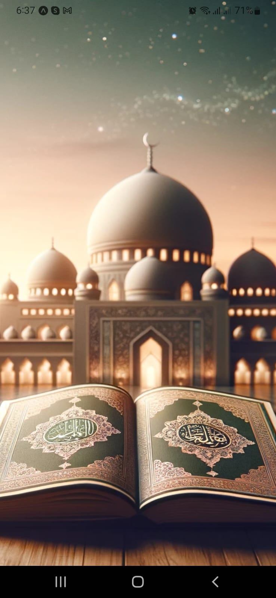
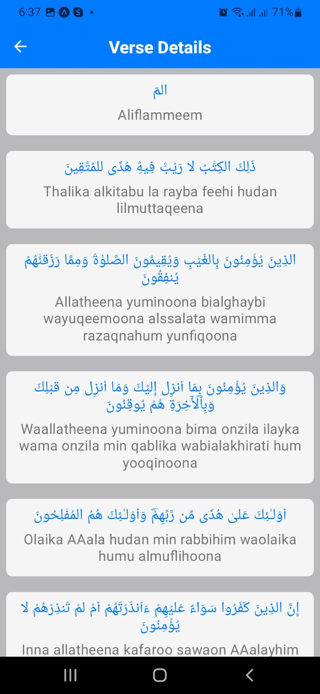
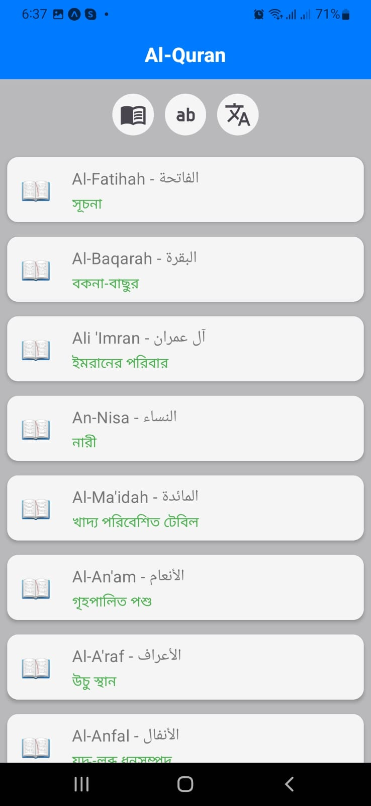
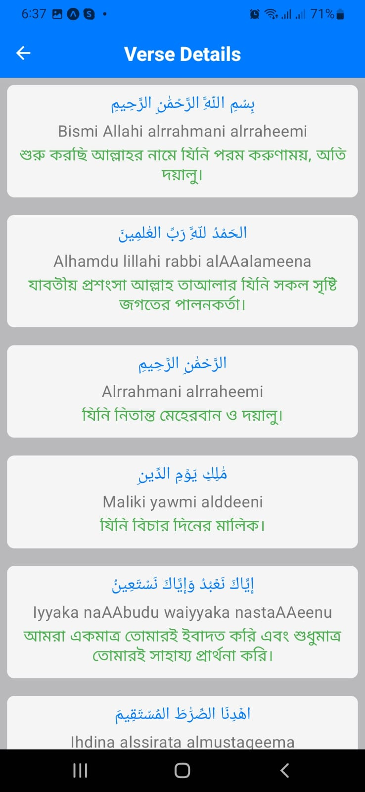

# Al-Quran

## Description
Al-Quran is a mobile application built with React Native Expo, designed for reading, studying, and listening to the Quran. It leverages React Native Paper and Reanimated for enhanced user experience.

# ScreenShots

  
  
  
  

## Features
- Read and study the Quran
- Listen to recitations
- User-friendly interface
- Smooth animations powered by Reanimated

## Technologies Used
- React Native Expo
- React Native Paper
- Reanimated
- (Add any other technologies used)

## Installation
1. Clone the repository.
2. Install dependencies using `npm install` or `yarn install`.
3. Start the Expo development server with `expo start`.
4. Scan the QR code with the Expo Go app to run the app on your device or emulator.

## Contributing
Contributions are welcome! Please refer to the [Contribution Guidelines](CONTRIBUTING.md) for more details.

## License
This project is licensed under the [MIT License](LICENSE).
